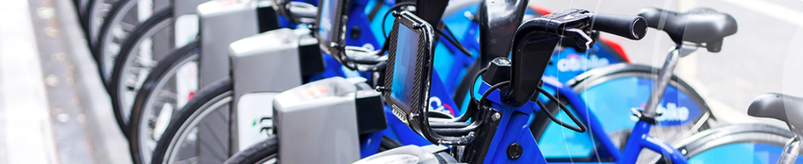

# Bikesharing

## Overview

This project is to analyze the NYC CitiBike Trip Data in 2018-2019, using Tableau, a data visualization tool, to explore the viability of a bike-sharing business in Des Moines, Iowa.

## Resources
* Data Sources: CitiBike Data, 201908-citibike-tripdata.csv.zip
* Software: Visual Basic Studio, Python 3.7, Tableau Public

## GitHub Application Link
<a href="https://jillibus.github.io/bikesharing/">bikesharing</a>

## CitiBike Tableau Analysis
<a href="https://public.tableau.com/authoring/CitiBike_Challenge_16393261332470/NYCCitiBikeChallengeStory#1"> CitiBike Challenge</a>

## RESULTS

## NYC CitiBike Data Visualizations for August 2019

* There were over 2,300,000 rides for the month of August 2019 in New York City alone.
* The younger riders tend to use the service for longer rides, but there is a wide range of ages, despite the "obvious joke ages entered".
* The top ride starting locations/stations are Manhattans most touristic and busiest areas.

 

* The top ending locations, shown below, also surrond the same areas in Manhattan as the start location/stations.

* The majority of the rides are finished within the first 30-40 minutes, and lasting under 1 hour.

* The largest group of users of the CitiBike bike-sharing are male at a little over 65%, although we are seeing quite a few women starting to use the bikes now that there are more available in downtown Manhattan.

* The weekday's busiest bike-sharing times are between the 07:00 AM to 09:00 AM and then the 05:00 PM to 07:00 PM timeframes.
* The weekend's busiest bike-sharing times are the busiest between 10:00 AM to 07:00 PM.
* The heatmap also shows, the biggest population that uses the bike-sharing are male riders.

* The highest activity is utilized from 05:00 PM to 07:00 PM and require the most resources.
* The lowest activity is during the hours from 02:00 AM to 05:00 AM, this would be the ideal time to perform Bike and Station maintenance.

## Summary

The data shows high activity of The CityBike bike-sharing service in the New York Manhattan downtown area.  This area is a high traffic, business as well as tourist area, that is difficult to find parking as well as known for heavy traffic and expensive parking lots.  The data shows that early morning and afternoon business workers are using the CityBike ride-sharing as an alternative to other forms of Public Transportation to arrive and depart from their place of business.  With trends of a more casual workplace, in which Female workers would be able to wear pants and/or pantsuits, and more access to a changing facility, I can forsee an increase of additional female workers joining this form of Public Transportation.

Additional analysis that would be beneficial would be:
  * The number of downtown gyms or buildings with gyms and changing rooms for commuters.
  * The analysis of the different months throughout the year and temperatures to see how the number of rides differed.

Thank you for your time, and let me know if you wish to see any additional data.

Jill Hughes

Jill Hughes
