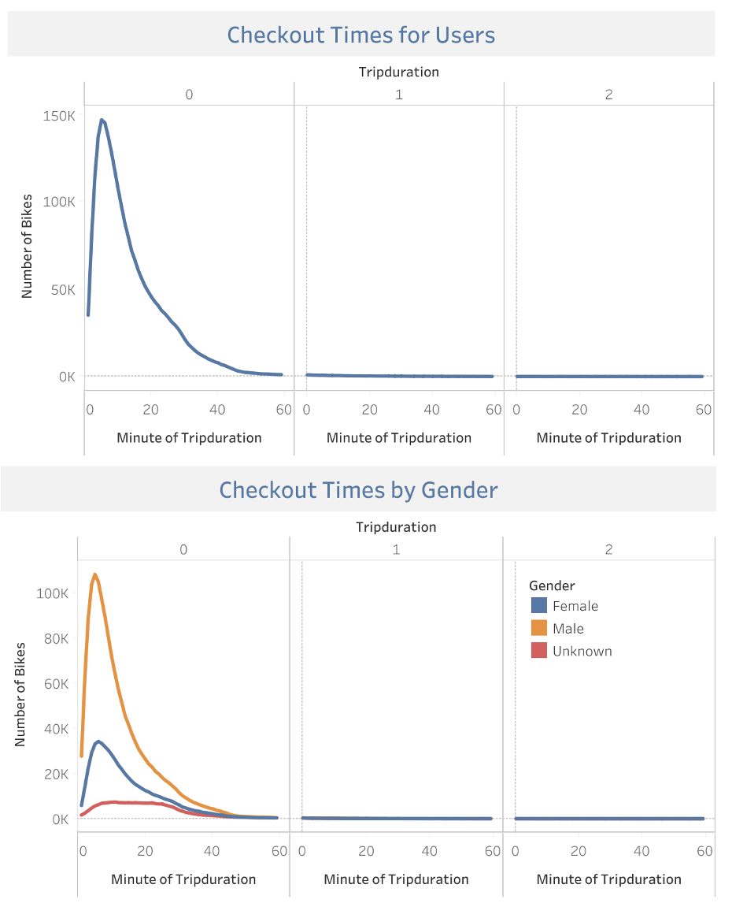

# Bikesharing

## Overview

This project is to analyze the NYC CitiBike Trip Data in 2018-2019, using Tableau, a data visualization tool, to explore the viability of a bike-sharing business in Des Moines, Iowa.

## Resources
* Data Sources: CitiBike Data, 201908-citibike-tripdata.csv.zip
* Software: Visual Basic Studio, Python 3.7, Tableau Public

## Application Link
<a href="https://jillibus.github.io/bikesharing/">bikesharing</a>

## Results
### CitiBike Tableau Analysis
<a href="https://public.tableau.com/authoring/CitiBike_Challenge_16393261332470/NYCCitiBikeChallengeStory#1"> CitiBike Challenge</a>

## RESULTS

## NYC CitiBike Data Visualizations for August 2019

### Quick Overview of CitiBike Data

* There were over 2,300,000 rides for the month of August 2019 in New York City alone.
* The younger riders tend to use the service for longer rides, but there is a wide range of ages, despite the "obvious joke ages entered".
* The top ride starting locations/stations are Manhattans most touristic and busiest areas.
* The top ending locations, shown below, also surrond the same areas in Manhattan as the start location/stations.

 

---

---

* The majority of the rides are finished within the first 30-40 minutes, and lasting under 1 hour.
* The largest group of users of the CitiBike bike-sharing are male at a little over 65%, although we are seeing quite a few women starting to use the bikes now that there are more available in downtown Manhattan.

---

* The weekday's busiest bike-sharing times are between the 07:00 AM to 09:00 AM and then the 05:00 PM to 07:00 PM timeframes.
* The weekend's busiest bike-sharing times are the busiest between 10:00 AM to 07:00 PM.
* The heatmap also shows, the biggest population that uses the bike-sharing are male riders.

* The highest activity is utilized from 05:00 PM to 07:00 PM and require the most resources.
* The lowest activity is during the hours from 02:00 AM to 05:00 AM, this would be the ideal time to perform Bike and Station maintenance.

### Summary

This project definitely dug into my skills with using HTML and playing with colors, fonts and making the charts look different and trying to not clash colors.  The examples we worked through during class time (activities) really helped with setting up the data of each different chart and helped a lot with making the plotting easy to understand.  I spend a lot of time going through the class activities once I go through all of the module to help myself understand the concepts better and they really help a lot.

The JavaScript code doesn't come to me that hard, as I have studied Java in college, but I am still having a bit of difficulty doing the new shorthand notation with the '=>' but I just need more practice.

But breaking down the bar chart first, getting that to populate, then doing the bubble, and getting that to work, then the gauge, definitely helped in understanding doing the 2 parts to get a chart to work.  1) calculating the data then 2) determining the layout.

Jill Hughes
